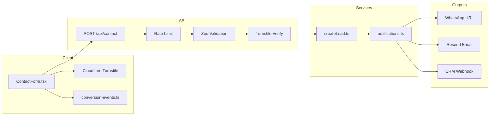

# Contact & Lead Capture System Architecture

Enterprise-grade lead pipeline for We Decor (Next.js 15 App Router).

## Overview



## API: `POST /api/contact`

| Status | Code | Meaning |
|--------|------|---------|
| 200 | — | Lead accepted |
| 400 | `VALIDATION_ERROR` | Invalid fields |
| 400 | `SPAM_DETECTED` | Honeypot / heuristics |
| 400 | `CAPTCHA_FAILED` | Turnstile failed |
| 403 | `ORIGIN_FORBIDDEN` | CSRF / origin check |
| 413 | `PAYLOAD_TOO_LARGE` | Body > 16KB |
| 429 | `RATE_LIMITED` | IP throttled |
| 500 | `INTERNAL_ERROR` | Safe generic error |

### Request body (JSON)

```json
{
  "name": "string",
  "phone": "string",
  "email": "string",
  "eventType": "string",
  "eventDate": "string | null",
  "budget": "string | null",
  "message": "string",
  "website": "",
  "turnstileToken": "string",
  "pageUrl": "optional"
}
```

### Success response

```json
{
  "success": true,
  "leadId": "uuid",
  "whatsappUrl": "https://wa.me/...",
  "message": "Thank you! ..."
}
```

## Service layer (`lib/services/leads/`)

| File | Role |
|------|------|
| `types.ts` | `LeadRecord`, API shapes, error codes |
| `validators.ts` | Shared Zod schema (API + tests) |
| `createLead.ts` | Single entry point for lead creation |
| `notifications.ts` | WhatsApp, email (Resend), webhook, logging |

**CRM path:** `createLead()` → `buildCrmPayload()` → `LEAD_WEBHOOK_URL`. Future DB insert hooks into `createLead()` only.

## Security

| Control | Implementation |
|---------|----------------|
| Validation | Zod + length limits + charset rules |
| Sanitization | `stripHtml()` on all text fields |
| XSS | No `dangerouslySetInnerHTML` on user input |
| CSRF | `Origin` / `Referer` allowlist (`lib/security/origin.ts`) |
| Rate limit | 5 req / 15 min / IP — Upstash Redis or in-memory fallback |
| Bot protection | Cloudflare Turnstile (server verify mandatory when configured) |
| Honeypot | Hidden `website` field |
| Spam heuristics | Link count, keyword blocklist |
| Logging | No PII in production logs — only `leadId` + event type |
| IP storage | Hashed via `LEAD_IP_HASH_SALT` |

## Analytics events (`lib/analytics/conversion-events.ts`)

| Event | When |
|-------|------|
| `generate_lead` (attempt) | Form submit started |
| `generate_lead` (success) | API 200 |
| `form_error` | Validation / API failure |
| Meta `Lead` | If `NEXT_PUBLIC_META_PIXEL_ID` set |
| Google Ads conversion | If conversion ID + label set |

## Environment variables

See `env/.env.example`. Production minimum:

- `NEXT_PUBLIC_SITE_URL`
- `NEXT_PUBLIC_TURNSTILE_SITE_KEY` + `TURNSTILE_SECRET_KEY` (recommended)
- `LEAD_NOTIFY_EMAIL` + `RESEND_API_KEY` (for email alerts)
- `UPSTASH_REDIS_REST_URL` + `UPSTASH_REDIS_REST_TOKEN` (multi-instance rate limits)

Optional: `LEAD_WEBHOOK_URL`, `NEXT_PUBLIC_GA_ID`, Meta/Google Ads IDs.

## Deployment (Vercel)

1. Set all server secrets in Vercel **Production** (not in git).
2. Use separate Preview env without production webhook/email if desired.
3. Register Turnstile hostname: `www.wedecorevents.com`.
4. Restrict Google API keys by referrer/IP if used elsewhere.

## Testing

```bash
npm run test:contact
npm run typecheck
npm run build
```

## File map

```
app/api/contact/route.ts
components/ContactForm.tsx
components/TurnstileField.tsx
lib/services/leads/
lib/rate-limit.ts
lib/security/{sanitize,turnstile,origin}.ts
lib/analytics/conversion-events.ts
tests/unit/*.test.ts
```
